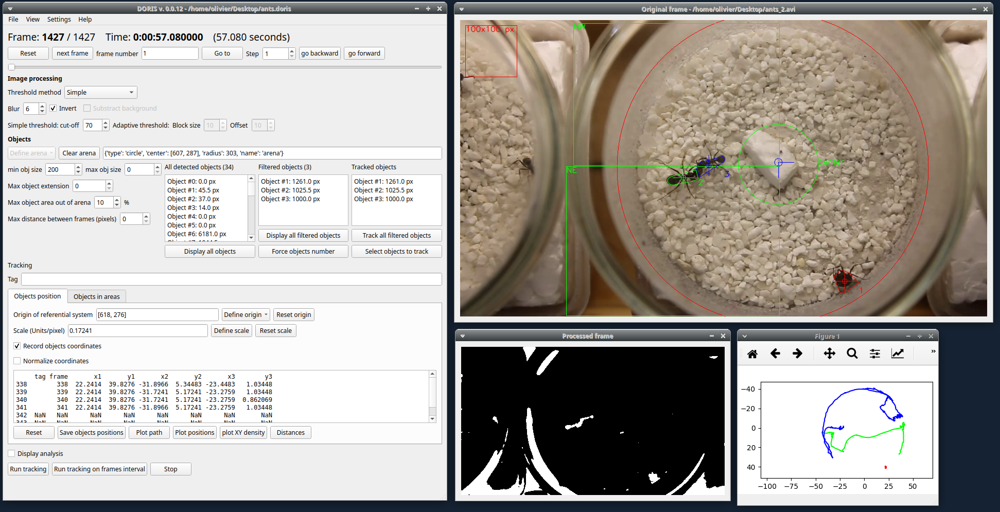

********************************************************************************************************************************************
DORIS user guide
********************************************************************************************************************************************

**DORIS is an easy-to-use interactive object detection and tracking software with a Graphical User Interface.
DORIS is a free and open-source software available for GNU/Linux, Windows and Mac OS.**

**version 0.0.17**

.. important:: **This is an ALPHA release. Use it for testing and report bugs and suggestions.**

`http://www.boris.unito.it/pages/doris <http://www.boris.unito.it/pages/doris>`_

This project was inspired by the **Tracktor project**: https://besjournals.onlinelibrary.wiley.com/doi/abs/10.1111/2041-210X.13166 https://github.com/vivekhsridhar/tracktor

.. contents::
   :depth: 2

Legal
============================================================================================================================================

Copyright 2019 Olivier Friard

**DORIS** is free software; you can redistribute it and/or modify
it under the terms of the GNU General Public License as published by
the Free Software Foundation; either version 2, or any later version.

**DORIS** is distributed in the hope that it will be useful,
but WITHOUT ANY WARRANTY; without even the implied warranty of
MERCHANTABILITY or FITNESS FOR A PARTICULAR PURPOSE.  See the
`GNU General Public License <http://www.gnu.org/copyleft/gpl.html>`_ for more details.

Install DORIS
============================================================================================================================================

.. include:: install_launch.rst

How to run a tracking project with DORIS step by step
============================================================================================================================================

.. include:: run_project.rst

..
    Objects detection
    ========================================================================================================================

    The frames extracted from video or directly available from a directory must
    be treated before objects detection.
    The frames are converted in binary image (b/w) where the white objects will
    be detected.

    Two methods are available:

    Simple threshold
    ----------------------------

    The frame is converted in graycale (from 0 to 255) and a simple threshold is
    applied. All values below the threshold will converted to black and the
    others to white.

    Adaptive threshold
    -----------------------------

    Invert image
    --------------------------------

    Option for inverting the binary image when dark objects should be detected.

    Blur
    ----------------------------------

    Definition of arena
    ----------------------------------

    If an arena is defined only the objects inside this arena will be detected
    and tracked.
    The arena can be defined as a rectangle, a circle or a polygon.

    Objects size
    ----------------------------------

    Minimum size: object with size lower than the minimum size will not be detected

    Maximum size: object with size greater than the mazimum size will not be detected

