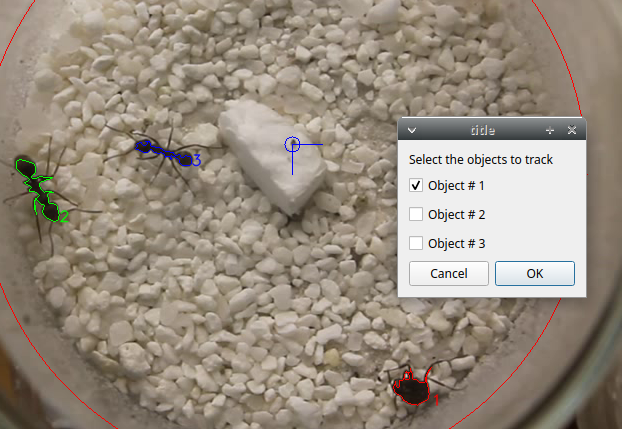
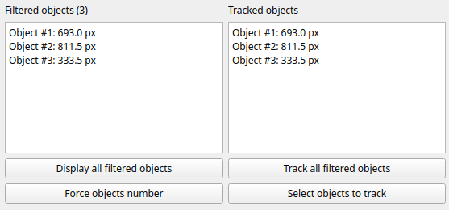
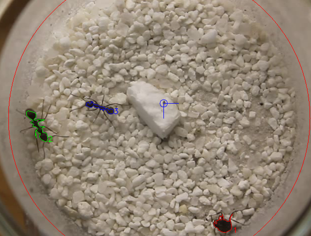
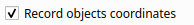
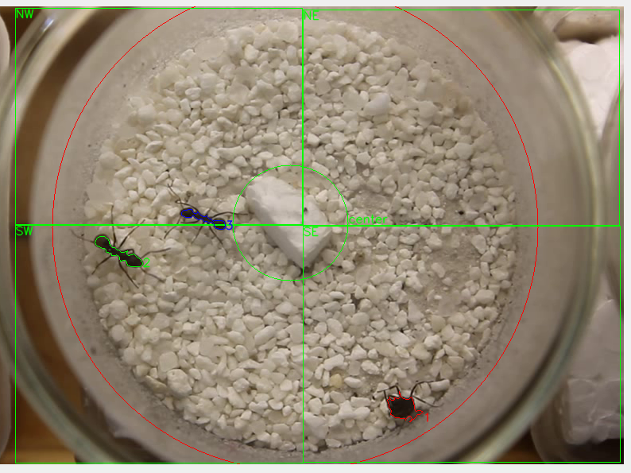
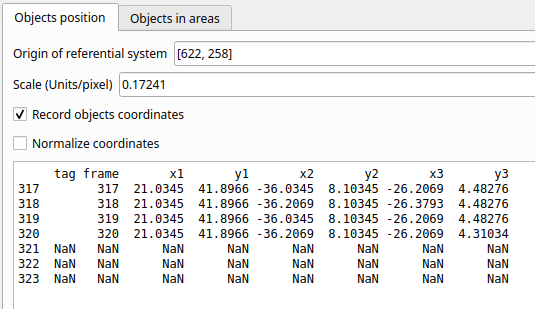
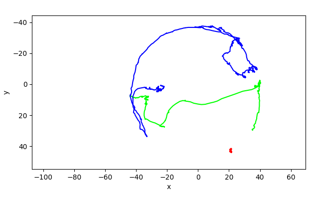
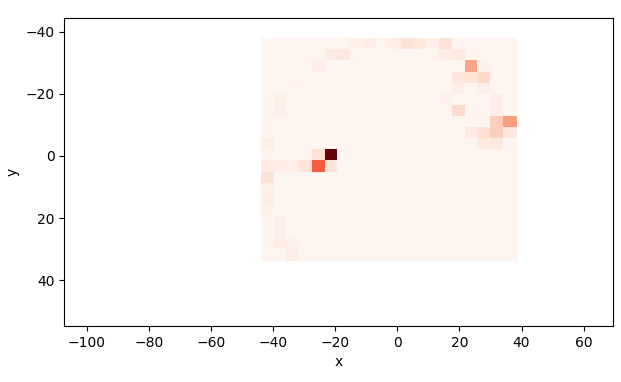
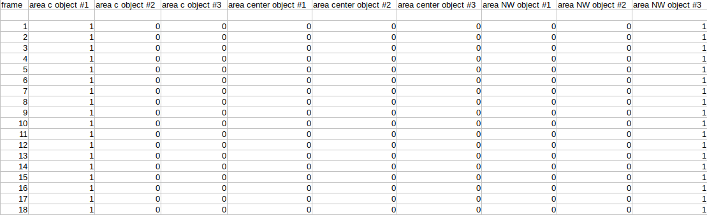
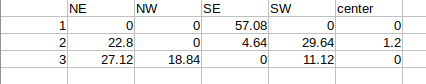

********************************************************************************************************************************************
DORIS user guide
********************************************************************************************************************************************

**DORIS** is an easy-to-use interactive object detection and tracking software.
**DORIS** has a Graphical User Interface.

DORIS is a free and open-source software available for GNU/Linux, Windows and Mac OS.

**version 0.0.12** **This is an ALPHA release. Use it for testing and report bugs and suggestions.**

DORIS web page: `http://www.boris.unito.it/pages/doris <http://www.boris.unito.it/pages/doris>`_

This project was inspired by the **Tracktor project**: https://besjournals.onlinelibrary.wiley.com/doi/abs/10.1111/2041-210X.13166 https://github.com/vivekhsridhar/tracktor

.. image:: images/doris_project.png
   :alt: DORIS
   :width: 100%

Legal
============================================================================================================================================

Copyright 2019 Olivier Friard

**DORIS** is free software; you can redistribute it and/or modify
it under the terms of the GNU General Public License as published by
the Free Software Foundation; either version 2, or any later version.

**DORIS** is distributed in the hope that it will be useful,
but WITHOUT ANY WARRANTY; without even the implied warranty of
MERCHANTABILITY or FITNESS FOR A PARTICULAR PURPOSE.  See the
`GNU General Public License <http://www.gnu.org/copyleft/gpl.html>`_ for more details.

How to run a tracking project with DORIS step by step
============================================================================================================================================

In order to demonstrate the use of BORIS we will set a tracking project.
This tracking project aims to track **3 ants** during 1 minute trying to **maintain individuality**.

A video tutorial is available at `www.youtube.com/watch?v=toSXiqsWRzY <https://www.youtube.com/watch?v=toSXiqsWRzY>`_ (no audio).

After launching DORIS you should see the main window.

Open a video
--------------------------------------------------------------------------------------------------------------------------------------------

**File** > **Open a video**

The video will be loaded and the first frame will be displayed in the **Original frame** window (left window).
Another window called **Processed frame** will also be displayed (right window).

.. image:: images/video_loaded.png
   :alt: video loaded
   :width: 100%

Frame processing
--------------------------------------------------------------------------------------------------------------------------------------------

The **Processed frame** window displays the frame after conversion to binary image (b/w), application of a blur filter
and eventually conversion to negative.

In this example we apply a **simple threshold method** to convert the grayscale image (values from 1 to 255) to binary (0 or 1).
Another threshold methods are available:
**Adaptive thresholding (mean)** and **Adaptive thresholding (Gaussian)**.
See the `OpenCV documentation <https://docs.opencv.org/3.4.0/d7/d4d/tutorial_py_thresholding.html>`_ for details.

DORIS will detect the white objects in the **Processed frame** window.

In this case you will have to check the **Invert checkbox** to convert to negative. The dark objects will be displayed in white
and the light objects in black:

.. image:: images/blur_invert.png
   :alt: Blur and Invert filters
   :width: 40%

The dark objects (like ants) are now displayed in white on the **Processed frame** window.

The **Filtered objects** list and the **Original frame** window display all the 60 filtered objects:

.. image:: images/filtered_objects60.png
   :alt: Filtered objects
   :width: 40%

The value of the **Blur** filter can be increased in order to simplify the objects.

.. image:: images/blur5_invert.png
   :alt: Blur and Invert filters
   :width: 40%

Applying a value of 5 to the Blur filter decrease the number of filtered objects to 25.

Arena definition
--------------------------------------------------------------------------------------------------------------------------------------------

An arena can be defined in order to limit the objects tracking to the objects detected inside the arena.

**Define arena** button > **Circle arena (3 points)**

Click on the video to define 3 points. The circular arena will pass through these 3 points.

.. image:: images/arena_definition.png
   :alt: Blur and Invert filters
   :width: 100%

The arena can be defined with a rectangle, a circle (using center - radius) or a polygon.

Objects size
--------------------------------------------------------------------------------------------------------------------------------------------

The object detection can be limited to objects included in a size interval (area).

Some detected objects are very small:

By setting the minimum object size to 100 px the number of detected objects decreases to 3.

.. image:: images/filtered_objects3.png
   :alt: Filtered objects
   :width: 40%

This matches with the 3 ants we want to track:

.. image:: images/3ants.png
   :alt: 3 ants
   :width: 100%

Selection of objects to track
--------------------------------------------------------------------------------------------------------------------------------------------

If you want to track all the filtered object click the **Track all filtered objects** button.
Otherwise if you want to track fewer objects click the **Select objects to track** button, then select the object number to track:

Origin definition (not mandatory)
--------------------------------------------------------------------------------------------------------------------------------------------

The origin of the referential system of coordinates can be defined.

**Define origin** button > **Origin from a point**

You will have to select the origin point on the video frame.

If an origin  is defined the coordinates of the tracked objects will refer to this origin.
Otherwise the origin is set in the upper-left corner of the frame.

Scale definition (not mandatory)
--------------------------------------------------------------------------------------------------------------------------------------------

A scale can be defined

**Define scale** button

You will have to define a segment (by clicking 2 points on the video frame) matching a reference of known size.

.. image:: images/scale_definition.png
   :alt: Scale definition
   :width: 80%

In this example the block has a length of 20 mm.

If a scale is defined the coordinates will be defined applying the scale. In this example in millimeters.

Record coordinates of tracked objects
--------------------------------------------------------------------------------------------------------------------------------------------

Check the **Record coordinates** checkbox

Record presence of the tracked objects in areas
--------------------------------------------------------------------------------------------------------------------------------------------

Select the **Objects in areas** tab and check the **Record presence of objects in areas** checkbox

You will have to define all the areas (rectangle, circle or polygon) using the **Add area** button.

In this example 5 areas were defined:

Run tracking
--------------------------------------------------------------------------------------------------------------------------------------------

Click the **Run tracking** button

The tracking process will start.
The tracked objects will be displayed on the **Original frame** window.

The coordinates of tracked objects are displayed in the **Objects position** list.

The presence of tracked objects in the defined areas are displayed in the **Presence of objects in areas** list.

The tracking can be run only on a frame interval with the **Run trackin on frames interval** button.

The tracking can be hidden to speed up the process: uncheck the **Display analysis** checkbox.

Coordinates
--------------------------------------------------------------------------------------------------------------------------------------------

This 3rd column will contain the frame number and the following columns the x,y coordinates of the various tracked objects.

The coordinates can be saved in a TSV file with the **Save objects positions** button.

The coordinates can be plotted:

* **Plot path** button.

* **Plot position** button.

The presence density can be plotted:

The total distances for every tracked objects can be exported in a TSV file with the **Distances** button:

.. image:: images/distances.png
   :alt: Distances
   :width: 30%

Presence in areas
--------------------------------------------------------------------------------------------------------------------------------------------

* The presence of objects in areas can be exported with the **Save results** button.

* The time in areas for every tracked objects can be exported with the **Time in areas** button:

..
    Objects detection
    ========================================================================================================================

    The frames extracted from video or directly available from a directory must
    be treated before objects detection.
    The frames are converted in binary image (b/w) where the white objects will
    be detected.

    Two methods are available:

    Simple threshold
    ----------------------------

    The frame is converted in graycale (from 0 to 255) and a simple threshold is
    applied. All values below the threshold will converted to black and the
    others to white.

    Adaptive threshold
    -----------------------------

    Invert image
    --------------------------------

    Option for inverting the binary image when dark objects should be detected.

    Blur
    ----------------------------------

    Definition of arena
    ----------------------------------

    If an arena is defined only the objects inside this arena will be detected
    and tracked.
    The arena can be defined as a rectangle, a circle or a polygon.

Objects size
----------------------------------

Minimum size: object with size lower than the minimum size will not be detected

Maximum size: object with size greater than the mazimum size will not be detected

