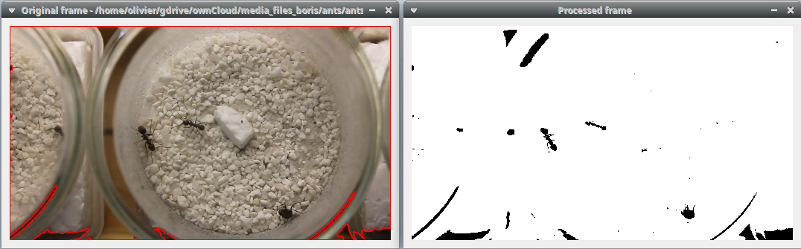
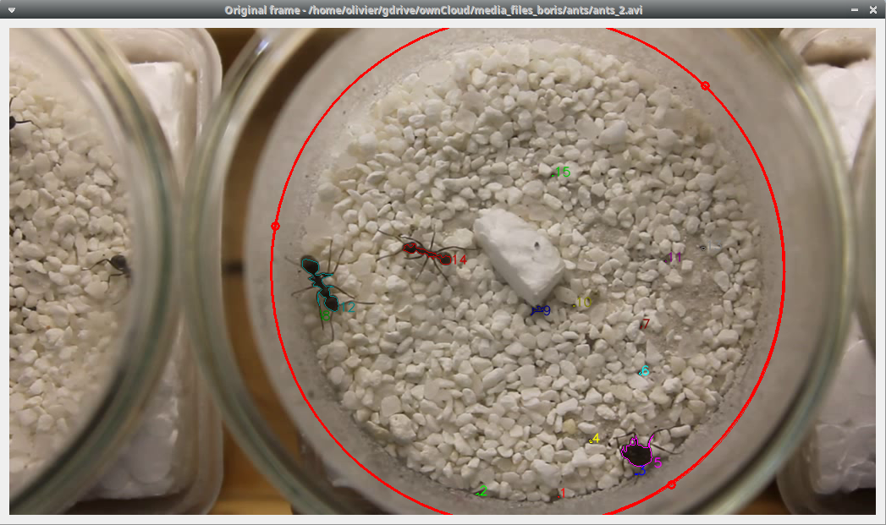

********************************************************************************************************************************************
DORIS user guide
********************************************************************************************************************************************

**DORIS** is an easy-to-use interactive object detection and tracking software.
**DORIS** has a Graphical User Interface.

DORIS is a free and open-source software available for GNU/Linux, Windows and Mac OS.

**version 0.0.12** **This is an ALPHA release. Use it for testing and report bugs and suggestion**

DORIS web site: `https://github.com/olivierfriard/DORIS <https://github.com/olivierfriard/DORIS>`_

Legal
============================================================================================================================================

Copyright 2019 Olivier Friard

**DORIS** is free software; you can redistribute it and/or modify
it under the terms of the GNU General Public License as published by
the Free Software Foundation; either version 2, or any later version.

**DORIS** is distributed in the hope that it will be useful,
but WITHOUT ANY WARRANTY; without even the implied warranty of
MERCHANTABILITY or FITNESS FOR A PARTICULAR PURPOSE.  See the
`GNU General Public License <http://www.gnu.org/copyleft/gpl.html>`_ for more details.

How to run a tracking project with DORIS step by step
============================================================================================================================================

In order to demonstrate the use of BORIS we will set a tracking project.
This tracking project aims to track **3 ants** during 1 minute trying to **maintain individuality**.

After launching DORIS you should see the main window.

.. image:: images/main_window_empty.png
   :alt: DORIS main window
   :width: 100%

Open a video
--------------------------------------------------------------------------------------------------------------------------------------------

**File** > **Open a video**

The video will be loaded and the first frame will be displayed in the **Original frame** window (left window).
Another window called **Processed frame** will also be displayed (right window).

Frame processing
--------------------------------------------------------------------------------------------------------------------------------------------

The **Processed frame** window displays the frame after conversion to binary image (b/w), application of a blur filter
and eventually conversion to negative.

DORIS will detect the white objects in the **Processed frame** window.

In this case you will have to check the **Invert checkbox** to convert to negative. The dark objects will be displayed in white
and the light objects in black:

.. image:: images/video_loaded_invert.png
   :alt: DORIS main window
   :width: 100%

The dark objects (like ants) are now displayed in white on the **Processed frame** window.

The **Filtered objects** list and the **Original frame** window display all the 60 filtered objects:

The value of the **Blur** filter can be increased in order to simplify the objects.

Applying a value of 5 to the Blur filter decrease the number of filtered objects to 25.

Arena definition
--------------------------------------------------------------------------------------------------------------------------------------------

An arena can be defined in order to limit the objects tracking to the objects detected inside the arena.

**Define arena** button > **Circle arena (3 points)**

Click on the video to define 3 points. The circular arena will pass through these 3 points.

The arena can be defined with a rectangle, a circle (using center - radius) or a polygon.

Objects size
--------------------------------------------------------------------------------------------------------------------------------------------

The object detection can be limited to objects included in a size interval (area).

Some detected objects are very small:

.. image:: images/filtered_objects15.png
   :alt: Filtered objects
   :width: 40%

By setting the minimum object size to 100 px the number of detected objects decreases to 3.

.. image:: images/objects_size.png
   :alt: Oobjects size
   :width: 40%

This matches with the 3 ants we want to track.

..
    Objects detection
    ========================================================================================================================

    The frames extracted from video or directly available from a directory must
    be treated before objects detection.
    The frames are converted in binary image (b/w) where the white objects will
    be detected.

    Two methods are available:

    Simple threshold
    ----------------------------

    The frame is converted in graycale (from 0 to 255) and a simple threshold is
    applied. All values below the threshold will converted to black and the
    others to white.

    Adaptive threshold
    -----------------------------

    Invert image
    --------------------------------

    Option for inverting the binary image when dark objects should be detected.

    Blur
    ----------------------------------

    Definition of arena
    ----------------------------------

    If an arena is defined only the objects inside this arena will be detected
    and tracked.
    The arena can be defined as a rectangle, a circle or a polygon.

