.. run_project.rst

In order to demonstrate the use of DORIS we will set a tracking project.
This tracking project aims to track **3 ants** during 1 minute trying to **maintain individuality**.

A video tutorial is available at `www.youtube.com/watch?v=toSXiqsWRzY <https://www.youtube.com/watch?v=toSXiqsWRzY>`_ (no audio).

After launching DORIS you should see the main window.

.. image:: images/main_window_empty.png
   :alt: DORIS main window
   :width: 100%

Open a video
--------------------------------------------------------------------------------------------------------------------------------------------

**File** > **Open a video**

The video will be loaded and the first frame will be displayed in the **Original frame** window (left window).
Another window called **Processed frame** will also be displayed (right window).

.. image:: images/video_loaded.png
   :alt: video loaded
   :width: 100%

A directory of images (from time lapse experiments for example) can also be used for tracking project: **File** > **Load directory of images**

Frame processing
--------------------------------------------------------------------------------------------------------------------------------------------

The **Processed frame** window displays the frame after conversion to binary image (b/w), application of a blur filter
and eventually conversion to negative.

In this example we apply a **simple threshold method** to convert the grayscale image (values from 1 to 255) to binary (0 or 1).
Another threshold methods are available:
**Adaptive thresholding (mean)** and **Adaptive thresholding (Gaussian)**.
See the `OpenCV documentation <https://docs.opencv.org/3.4.0/d7/d4d/tutorial_py_thresholding.html>`_ for details.

DORIS will detect the white objects in the **Processed frame** window.

In this case you will have to check the **Invert checkbox** to convert to negative. The dark objects will be displayed in white
and the light objects in black:

.. image:: images/blur_invert.png
   :alt: Blur and Invert filters
   :width: 40%

.. image:: images/video_loaded_invert.png
   :alt: DORIS main window
   :width: 100%

The dark objects (like ants) are now displayed in white on the **Processed frame** window.

The **Filtered objects** list and the **Original frame** window display all the 60 filtered objects:

.. image:: images/filtered_objects60.png
   :alt: Filtered objects
   :width: 40%

The value of the **Blur** filter can be increased in order to simplify the objects.

.. image:: images/blur5_invert.png
   :alt: Blur and Invert filters
   :width: 40%

Applying a value of 5 to the Blur filter decrease the number of filtered objects to 25.

Arena definition
--------------------------------------------------------------------------------------------------------------------------------------------

An arena can be defined in order to limit the objects tracking to the objects detected inside the arena.

**Define arena** button > **Circle arena (3 points)**

Click on the video to define 3 points. The circular arena will pass through these 3 points.

.. image:: images/arena_definition.png
   :alt: Blur and Invert filters
   :width: 100%

The arena can be defined with a rectangle, a circle (using center - radius) or a polygon.

Objects size
--------------------------------------------------------------------------------------------------------------------------------------------

The object detection can be limited to objects included in a size interval (area).

Some detected objects are very small:

.. image:: images/filtered_objects15.png
   :alt: Filtered objects
   :width: 40%

By setting the minimum object size to 100 px the number of detected objects decreases to 3.

.. image:: images/objects_size.png
   :alt: Oobjects size
   :width: 40%

.. image:: images/filtered_objects3.png
   :alt: Filtered objects
   :width: 40%

This matches with the 3 ants we want to track:

.. image:: images/3ants.png
   :alt: 3 ants
   :width: 100%

Save project
--------------------------------------------------------------------------------------------------------------------------------------------

The project can be saved on a file (*.doris) in order to reopen it with al parameters already set.
**File** > **Save project**

Selection of objects to track
--------------------------------------------------------------------------------------------------------------------------------------------

If you want to track all the filtered object click the **Track all filtered objects** button.
Otherwise if you want to track fewer objects click the **Select objects to track** button, then select the object number to track:

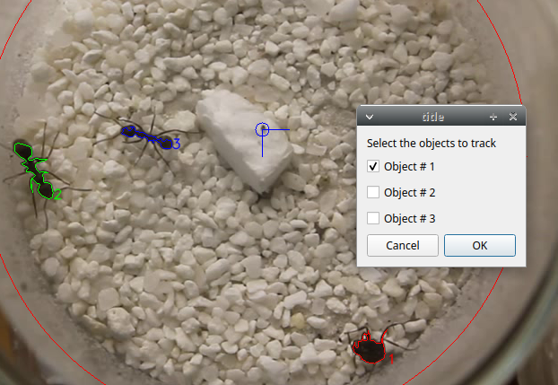

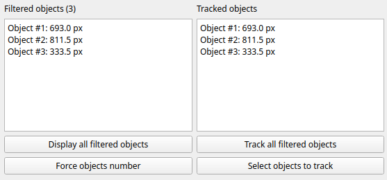

Origin definition (not mandatory)
--------------------------------------------------------------------------------------------------------------------------------------------

The origin of the referential system of coordinates can be defined.

**Define origin** button > **Origin from a point**

You will have to select the origin point on the video frame.

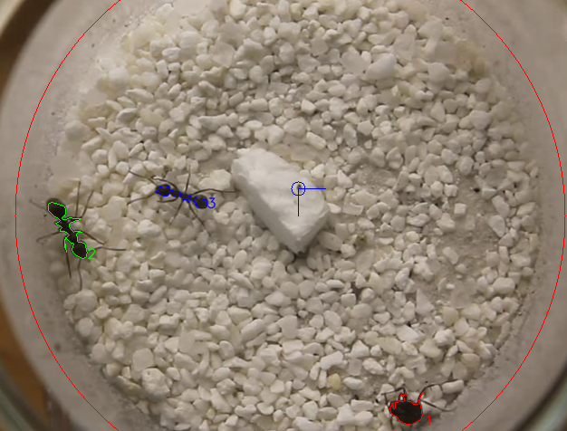

The X axis extends from left to right. The Y axis extends from top to bottom.

If an origin is defined the coordinates of the tracked objects will refer to this origin.
Otherwise the origin is set in the upper-left corner of the frame.

Scale definition (not mandatory)
--------------------------------------------------------------------------------------------------------------------------------------------

A scale can be defined in order to obtain values with a real unit (m, cm, mm ...).

**Define scale** button

You will have to define a segment (by clicking 2 points on the video frame) matching a reference of known size.

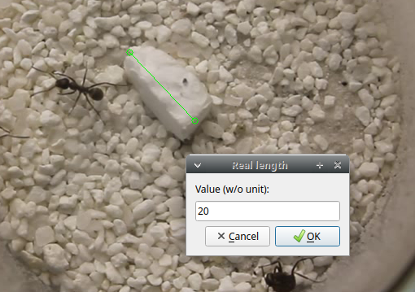

In this example the block has a length of 20 mm.

If a scale is defined the coordinates will be defined applying the scale. In this example in millimeters.

Record coordinates of tracked objects
--------------------------------------------------------------------------------------------------------------------------------------------

Check the **Record coordinates** checkbox

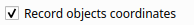

Record presence of the tracked objects in areas
--------------------------------------------------------------------------------------------------------------------------------------------

Select the **Objects in areas** tab and check the **Record presence of objects in areas** checkbox

You will have to define all the areas (rectangle, circle or polygon) using the **Add area** button.

In this example 5 areas were defined:

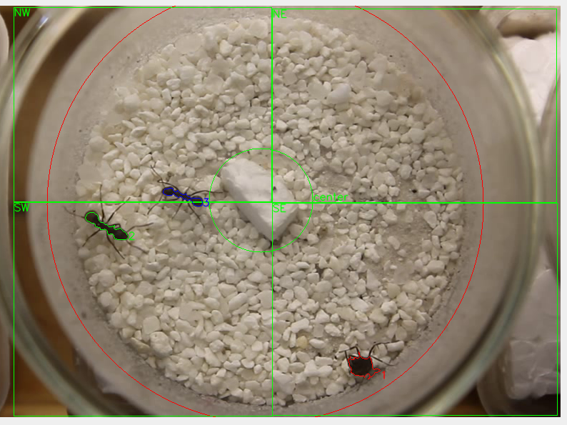

Run tracking
--------------------------------------------------------------------------------------------------------------------------------------------

Click the **Run tracking** button

The tracking process will start.
The tracked objects will be displayed on the **Original frame** window.

The coordinates of tracked objects are displayed in the **Objects position** list.

The presence of tracked objects in the defined areas are displayed in the **Presence of objects in areas** list.

The tracking can be run only on a frame interval with the **Run trackin on frames interval** button.

The tracking can be hidden to speed up the process: uncheck the **Display analysis** checkbox.

Coordinates
--------------------------------------------------------------------------------------------------------------------------------------------

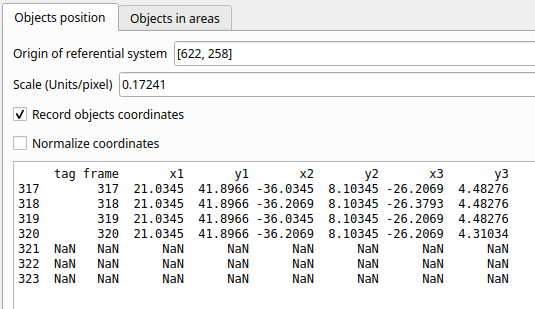

This 3rd column will contain the frame number and the following columns the x,y coordinates of the various tracked objects.

The coordinates can be saved in a TSV file with the **Save objects positions** button.

The coordinates can be plotted:

* **Plot path** button.

* **Plot position** button.

.. image:: images/plot_path.png
   :alt: Plot path
   :width: 80%

The presence density can be plotted:

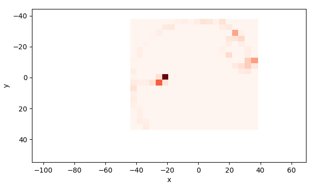

The total distances for every tracked objects can be exported in a TSV file with the **Distances** button:

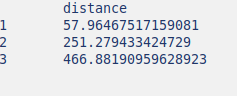

Presence in areas
--------------------------------------------------------------------------------------------------------------------------------------------

* The presence of objects in areas can be exported with the **Save results** button.

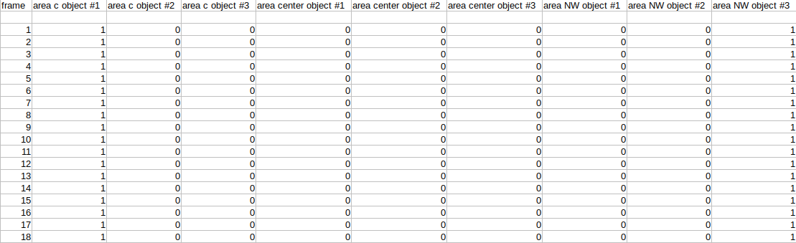

* The time in areas for every tracked objects can be exported with the **Time in areas** button:

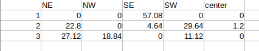

